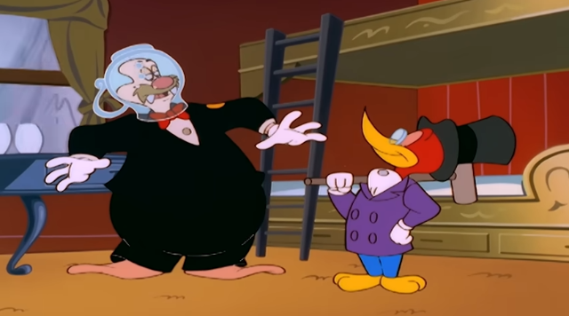
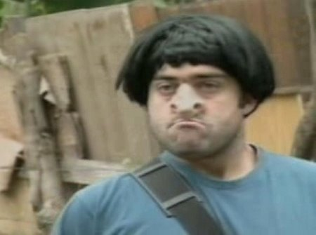
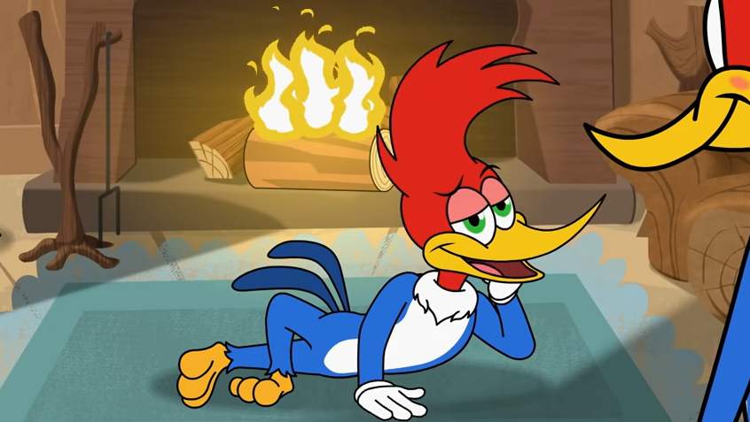
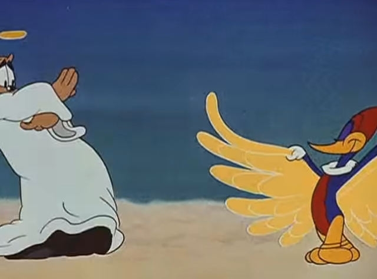

# Pica-Pau Biruta  

_postado por **um vagabundo que não vai programar** em 14 de agosto de 2022 04:48_

---

São três da manhã de um domingo que veio após um sábado em que eu acordei às _quatro da tarde_. Passei o dia todo enrolando para começar a implementar as colisões no jogo, e para finalizar um dia improdutivo nada melhor do que reflexões improdutivas.  
  
Neste momento estou ouvindo isto:  
<iframe width="560" height="315" src="https://www.youtube-nocookie.com/embed/A42gKiC0zxI" title="YouTube video player" frameborder="0" allow="accelerometer; autoplay; clipboard-write; encrypted-media; gyroscope; picture-in-picture" allowfullscreen></iframe>  
  
Esta não é nenhuma música memorável ou que eu goste muito -- na verdade é a primeira vez que ouço, e estou ouvindo _porque o youtube achou que eu devia ouvir isso_. Não é nem muito bom nem muito ruim, e provavelmente vai ser a única vez que vou ouvir mesmo.  
  
## Procrastinação  
  
Hoje foi um dia da mais pura e simples procrastinação: algumas vezes isso é bom. Para ser totalmente justo comigo, eu trabalhei uma ou duas horas pela tarde, mas o resto do dia foi só enrolação. Não programei nada e fiquei vendo vídeo no youtube enquanto jogava _R-Type_.  
  
Toda vez que me vem a palavra _procrastinação_ na cabeça, me vem esse episódio do Pica-Pau:  
  
> <iframe width="560" height="315" src="https://www.youtube-nocookie.com/embed/54uG-7esUZY" title="YouTube video player" frameborder="0" allow="accelerometer; autoplay; clipboard-write; encrypted-media; gyroscope; picture-in-picture" allowfullscreen></iframe>  
>  
> _O trabalho e como escapar dele, por João Faz Nada._  
  
Eu passei a minha infância assistindo esses desenhos na televisão. Eu não sou tão velho assim, é só o SBT que passava a mesma coisa a _setecentos e trinta e sete anos_.  
  
## O Pica-Pau gente boa  
  
Existem diversas gerações do desenho do pica-pau, quando eu era criança eu gostava da versão "gente boa" do pica-pau. Aquele que tinha o _pé de pano_ e era perseguido constantemente por coisas como o _míssil tele-guiado que persegue todo  mundo que resolve não contratar um seguro de vida_. Este era um pica-pau correto, com valores e caráter: ele era sempre _a vítima_.  
  
> <iframe width="560" height="315" src="https://www.youtube-nocookie.com/embed/PuU9CYM-Aak" title="YouTube video player" frameborder="0" allow="accelerometer; autoplay; clipboard-write; encrypted-media; gyroscope; picture-in-picture" allowfullscreen></iframe>  
>  
> _Fells Bargo_  
  
## O Pica-Pau idiota  
  
Muito tempo depois saiu a série nova do Pica-Pau, _em que ele era apenas idiota_. Idiota demais, ao ponto de ser sem propósito.  
  
>  
> _ISSO AQUI É UMA **PORCARIA** QUE NÃO .. MERDA NENHUMA. ME DESCULPE_  
  
Esse desenho era _uma porcaria_, e veio numa época em que os desenhos animados estavam cada vez mais idiotas. Além disso, a arte e a animação eram ruins -- eu não me submetia a assistir esse lixo. Até porque eu já tinha uns vinte anos quando essa porcaria apareceu por aqui na tv aberta.  
  
>
> _Eu mudava de canal mesmo, meu._  
  
Mas, dá pra piorar?  
  
## O Pica-Pau Idiota _E_ Pós-Moderno  
  
> 
> Dá.  
  
## O Pica-Pau biruta  
  
Quando eu era criança, não gostava dessa versão -- provavelmente porque eu era uma criança idiota. Achava ele muito maluco, _ele não fazia a coisa certa_.  
  
> <iframe width="560" height="315" src="https://www.youtube-nocookie.com/embed/uch9UU0yjT4" title="YouTube video player" frameborder="0" allow="accelerometer; autoplay; clipboard-write; encrypted-media; gyroscope; picture-in-picture" allowfullscreen></iframe>  
>  
> _Eu sou o diabo necessário_.  
  
Apenas sepois de velho eu percebi que _essa é a melhor versão_, o pica-pau mais _maroto_ de todos.  
  

> 
> _Só faz bobagem e ainda vai pro céu_.  
  
Esta é a encarnação do caos, a materialização do mal, a zueira pela zueira. Ele _rouba a polícia_. Ele fala _"gasosa"_. Ele peita as autoridades. _Ele usa gola rolê com polainas._  
  
> <iframe width="560" height="315" src="https://www.youtube-nocookie.com/embed/NzeBZt7j0wY" title="YouTube video player" frameborder="0" allow="accelerometer; autoplay; clipboard-write; encrypted-media; gyroscope; picture-in-picture" allowfullscreen></iframe>  
>  
> _Rinocetélius._  
  
## Praticamente um _sommelier_  
  
Se eu estivesse escrevendo este post em inglês estaria tudo sossegado. Mas o problema é que o personagem se chama pica-pau, e isso tem mais sentidos em português do que o desenho tem episódios.  
  
Mas, temos que admitir algumas coisas, então o importante é ter _certeza absoluta_ que a bateria do meu teclado não acabe enquanto escrevo isso: após essa análise toda, eu posso dizer que _sou um sommelier de pica-