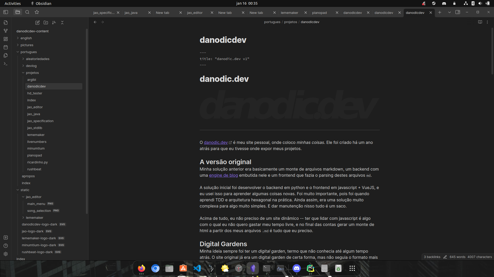
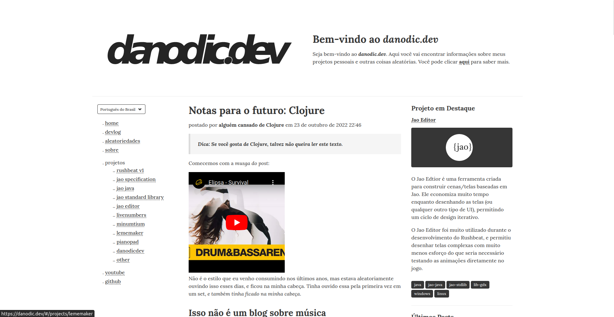
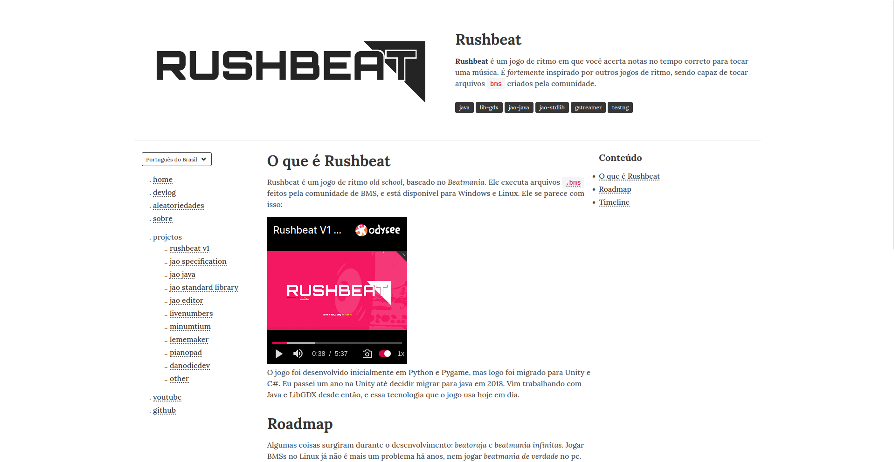
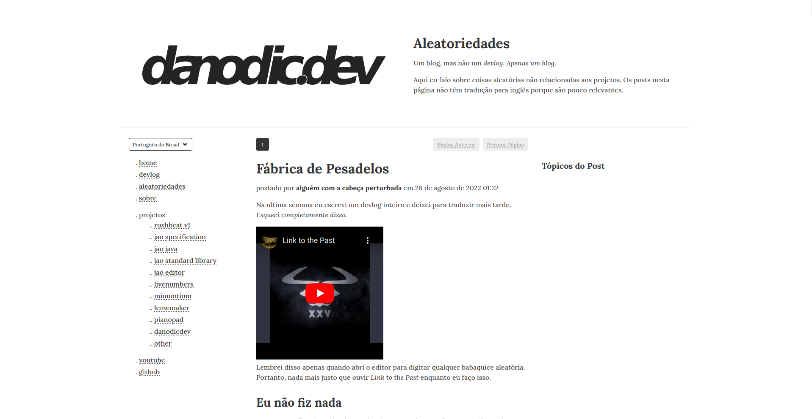
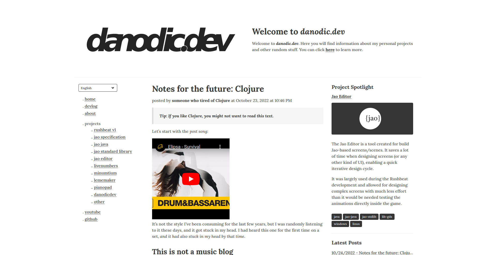

# danodic.dev

---

O [danodic.dev](https://danodic.dev) é meu site pessoal, onde coloco _minhas coisas_. Ele foi criado em 2022, para que eu tivesse onde expor meus projetos.

## A versão original
Minha solução anterior era basicamente um monte de arquivos markdown, um backend com uma [engine de blog](minumtium.md) embutida nele e um frontend que fazia o parsing destes arquivos `md`.

A solução inicial foi desenvolver o backend em python e o frontend em javascript + VueJS, e eu usei isso para aprender algumas coisas novas. Foi muito importante, pois foi quando aprendi TDD e arquitetura hexagonal na prática. Ainda assim, era uma solução muito complexa para algo muito simples. E dar manutenção nisso tudo é um saco.

Acima de tudo, eu não preciso de um site dinâmico -- ter que lidar com javascript é algo com o qual eu não quero gastar meu tempo livre, e no final das contas gerar um monte de html a partir dos meus arquivos `.md` é tudo que eu preciso.

## Digital Gardens
Minha ideia sempre foi ter um _[digital garden](../notas/coisas/digital_gardens.md)_, termo que não conhecia até algum tempo atrás. O site original já era um digital garden de certa forma, mas não seguia o formato mais comum.

Há algum tempo atrás eu conheci o [Obsidian](https://obsidian.md), a aprendi sobre todo esse lance de _second brain_ e _digital garden_. Então eu percebi que era _isso_ que eu queria que o danodic.dev fosse.

Eu estava reescrevendo este site em Clojure + Clojurescript quando percebi que eu estava simplesmente abordando o problema da mesma forma que antes, com uma linguagem diferente.

Quando aprendi sobre ferramentas como _Obsidian Publish_, _Quartz_ e outros, percebi que essa era a direção que eu deveria seguir.

## A nova solução
Conseguir apenas publicar meus arquivos markdown é basicamente o que eu gostaria que acontecesse. Eu inclusive abro mão do sistema de blogging em prol de ter coisas como _backlinks_ e _mind maps_.

Depois de muito buscar, vi que o que realmente me atenderia é o _obsidian publish_, mas ele é caro para os padrões brasileiros. Apos bastante pesquisa, vi que o [mkdocs](https://mkdocs.org) fazia quase tudo que eu queria -- não tem os backlinks nem o mind map, mas eu devo conseguir implementar isso via plugins.

No final das contas esse site é simplesmente meu vault do obsidian publicado no GCP.

> 
> _Meu vault do obsidian._

## Tecnologia

A versão atual usa _mkdocs_ com Python, e é isso. Tudo é gerado estaticamente usando mkdocs. Isso está integrado em um pipeline do cloud build, que simplesmente copia os arquivos para um bucket to GCS.

O GCP está configurado para servir o site estático a partir do bucket do GCS.

Não existe mais banco de dados nem container -- tudo é estático. O custo diminuiu de ~R$50,00 por mês para _normalmente nada._

---

## Histórico

Houveram versões anteriores deste site, que estão documentadas abaixo.

### Versão 1

Percebi que não tinha um lugar adequado para compartilhar meus projetos quando terminei o Rushbeat. Eu não estava interessado em publicar o código ou até mesmo liberar o jogo, eu só queria algo para dizer "eu fiz isso". Com isso, decidi finalmente criar uma página de portfólio adequada.  
  
Esta página pode vir a conter outros projetos e coisas que tenho em mente, mas no momento é um blog e repositório de projeto pessoal.  
  
Este site é _deployado_ no GCP usando o Cloud Run para frontend e backend. Além disso, ele usa Python, Postgres, FastAPI e Minumtium para backend e Javascript, Bulma e VueJS para frontend.  
  
Levou um tempo razoável para montar esta página, pois não sei _nada_ sobre desenvolvimento de front-end e escrevi _um monte_ de coisas para cada página. Acabei tirando muito do conteúdo original e tornei tudo muito mais simples -- o conteúdo original está salvo para futuras postagens no blog. Além disso, todo o desenvolvimento  do [minumtium](/projects/minumtium) foi feito durante este período de tempo.  

#### Screenshots
Isso é como a primeira versão se parecia:

  

---

## Posts e Devlogs Relacionados  
- [Devlog #4: danodic.dev está pronto](/devlog/post/6)  

---

## Timeline  
- **Março de 2022 ~ agosto de 2022** - Versão inicial.
-  **Janeiro de 2023** - Segunda versão.