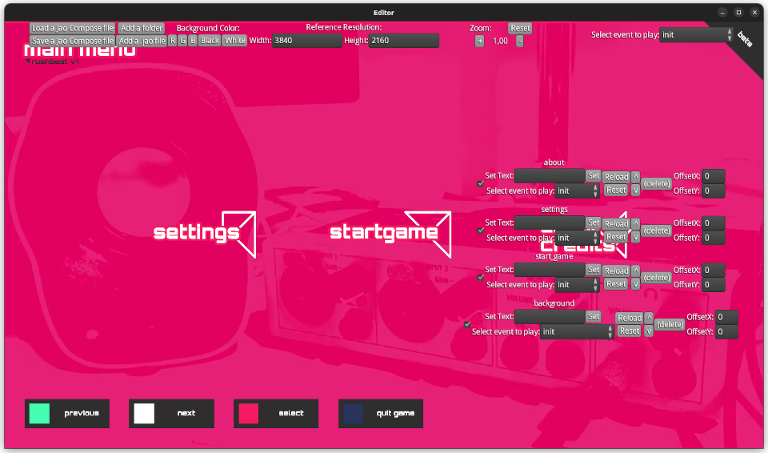
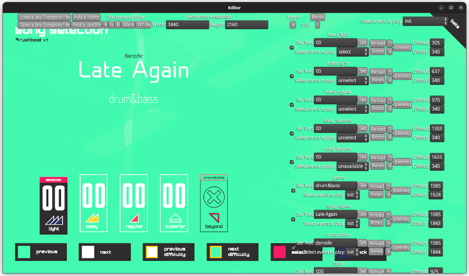

# Jao Editor 

{: style="height:200px;width:200px"} 
  
O JAO Editor é uma ferramenta de suporte criada durante o desenvolvimento do [Rushbeat](/en/projects/rushbeat) para acelerar o desenvolvimento de layouts de tela e arquivos JAO.  
  
Ele é capaz de fazer algumas coisas:  
  
- Carregar um arquivo ou pasta `.jao` e visualizá-lo.  
- Ser capaz de ampliar e deslocar para ver os pixels com mais nitidez.  
- Acionar eventos individualmente sob demanda.  
- Recarregar o arquivo com um clique de botão, para que eu possa ver as alterações sem recarregar o editor.  
- Criar arquivos de cena para salvar o estado de um layout de tela.  
  
A interface do usuário é construída usando a biblioteca de UI da LibGDX e está bastante crua no momento. 

Se parece com isto:  

---

> **Cena do menu principal, um exemplo de tela mais simples**:  
>
>
>  
> Essa tela mostra a capacidade de usar elementos com deslocamentos arbitrários. Além disso, o editor reproduz o vídeo de fundo e a toca música/sons também.  
>  
> Usando o menu suspenso no canto superior direito, eu posso alterar o evento para todos os elementos ao mesmo tempo. Ele lista todos eventos de todos os elementos. O elemento não renderizará nada caso não tenha um evento específico que tenha sido selecionado.  

---

> **A tela de seleção de músicas, uma cena bastante complexa**:  
>  
> 
>  
> Esta tela é um caso de uso muito bom para o editor de cena, pois seria _muito complexo_ construir esta tela de outra forma. Você pode ver a quantidade de camadas que tem à esquerda (a lista rola, mas não tem barra de rolagem) e que algumas as camadas têm ações diferentes selecionadas, bem como texto diferente.  
>  
> É possível mover as camadas para cima e para baixo, bem como ativar/desativar camadas.  

---

> **Carregando um arquivo jao e brincando com ele**:  
>  
> <iframe id="odysee-iframe" width="560" height="315" src="https://odysee.com/$/embed/rushbeat_devlog_jao_editor/a1b8a079d542d7699df3d5531a7381f3cc950825?r=GyzQyAbgfvfH2srncUFCMMRBHCm4SPGL" allowfullscreen></iframe>  
>  
> Neste vídeo eu carrego um arquivo jao e faço algumas coisas com ele:  
> - Altero o evento algumas vezes.  
> - Defino um texto no elemento.  
> - Desloco a viewport.  
> - Altero o nível de zoom.  
> - Altero a cor de fundo para ajudar a visualizar melhor.  
  
## Timeline  
  
- **Janeiro de 2020** - versão inicial do editor. [[Video]](https://odysee.com/@danodic.dev:5/rushbeat_devlog_jao_viewer:f)  
- **Março de 2020** - melhorias no editor. [[Video 1]](https://odysee.com/@danodic.dev:5/rushbeat_devlog_jao_compose_file_and_offset_support:6) [[Video 2]](https://odysee.com/@danodic.dev:5/rushbeat_devlog_layer_support_in_jao_visualizer:c)