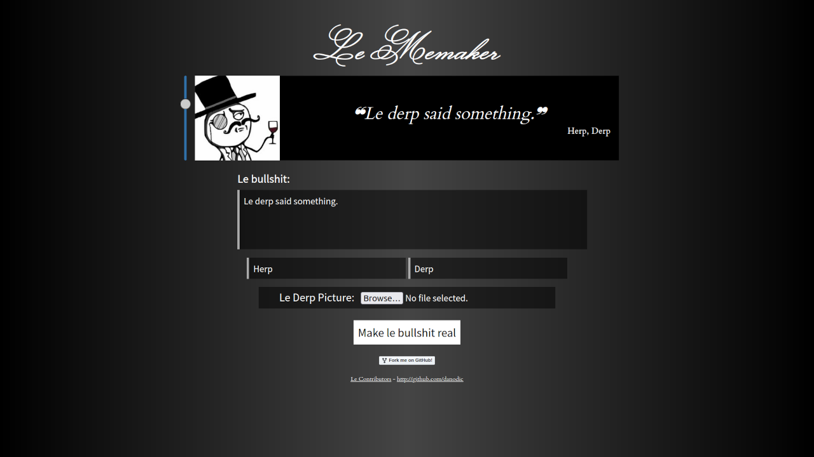

# Le Memaker ([GitHub](https://github.com/danodic/lememaker))  

---

---

Le Memaker é uma ferramenta para gerar memes de citação rapidamente, tornando simples o processo de transformar o meme em uma imagem e imprimir. Ele permite utilizar uma imagem e escrever um quote com o nome de alguém embaixo.  
  
Este repositório tem contribuições de mais duas pessoas:  
  
- Gustavo Schonarth - [https://github.com/schonarth](https://github.com/schonarth)  
- Leandro Barbosa - [https://github.com/MuTLY](https://github.com/MuTLY)  
  
Você pode acessar ele em [https://lememaker.herokuapp.com](https://lememaker.herokuapp.com).  
  
## Tecnologia  
O Le Memaker é totalmente client-side, então é escrito em Javascript com Jquery. Ele foi _deployado_ no Heroku como _uma página php fake_.  
  
## Timeline  
  
- **Julho ~ Agosto de 2019** - Tudo foi feito em 2 ou 3 semanas.