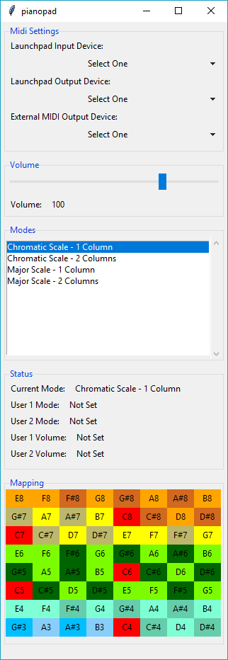

# Pianopad ([GitHub](https://github.com/danodic/pianopad))  

{: style="height:200px;width:200px"}

---

O Pianopad é uma aplicação que permite usar dispositivos MIDI Novation Launchpad como uma superfície de teclado cromático em qualquer software de DAW que aceite input MIDI. Ele funciona como um proxy entre a DAW e o controlador, traduzindo os _keystrokes_ em eventos MIDI específicos e provendo os highlights corretos na matriz de botões.  
  
Ele permite criar mapeamentos customizados e faz coisas como _scrollar_ a escala, alterar os volumes de ataque e até usar o launchpad como um _teclado de verdade_. Ele se parece com isso:  

> O Pianopad não é mais desenvolvido ou mantido.  
  
## Tecnologia  
Se não me engano eu usei Python 3.6 para desenvolver isso. Python foi a primeira opção porque eu estava passando pela _fase fanboy_. Isso ajudou a ter um protótipo rápido, então não me arrependo da decisão. Além disso, usa tkinter para a UI e mido como a biblioteca para gerar os eventos MIDI. Eu usei cx-freeze para gerar o executável final e o pipenv para gerenciar as dependências.  
  
## Timeline  
  
- **Agosto ~ Setembro de 2017** - Versão inicial foi criada e lançada no GitHub.  
- **Outubro de 2021** - Adicionei a funcionalidade de desabilitar o _root note_ do mapeamento e aceitei uma contribuição para alterar o layout da tela principal.