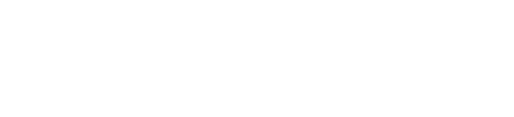

# Rushbeat

---

Rushbeat é um jogo de ritmo _old school_, baseado no _Beatmania_. Ele executa arquivos [`.bms`](https://en.wikipedia.org/wiki/Be-Music_Source) feitos pela comunidade de BMS, e funciona em Windows e Linux. Ele se parece com isso:  
  
<iframe id="odysee-iframe" width="560" height="315" src="https://odysee.com/$/embed/rushbeat_v1_gameplay/530955d5a58a4250af0239c65d33b98956a00110?r=GyzQyAbgfvfH2srncUFCMMRBHCm4SPGL" allowfullscreen></iframe>  
  
  
O jogo foi desenvolvido inicialmente em Python e Pygame, mas logo foi migrado para Unity e C#. Eu passei um ano na Unity até decidir migrar para java em 2018. Vim trabalhando com Java e LibGDX desde então, e essa tecnologia que o jogo usa hoje em dia.  
  
## Roadmap  
  
Algumas coisas surgiram durante o desenvolvimento: _beatoraja_ e _beatmania infinitas_. Jogar BMSs no Linux já não é mais um problema há anos, nem jogar _beatmania de verdade_ no pc. Provavelmente não vou seguir em frente com uma nova versão do jogo. Eu meio que implementei tudo que eu queria e as motivações que eu tinha para seguir com o jogo já não existem mais. E depois de tanto tempo, quero fazer outra coisa.  
  
## Timeline  
  
Eu tenho vídeos para cada um dos itens na lista abaixo, mas não vou compartilhar já que eles tem áudio aleatório de coisas tocando no fundo (podcast, videos, etc).  
  
- **Novembro de 2017 até o início de Janeiro de 2018** - Durante este período eu fiz o primeiro protótipo em Python. O primeiro registro que eu tenho é de 22 de novembro de 2017.  
- **Janeiro de 2018 até Dezembro de 2018** - Durante este período eu fiz o desenvolvimento na Unity. A maior parte das características de gameplay foram desenvolvidas durante este momento. Eu fiquei alguns meses sem fazer nada durante este período.  
- **Dezembro de 2018 até Janeiro de 2019** - Migração para java. Após este período eu fiquei quase 6 meses sem tocar no jogo.  
- **Setembro 2019 até Fevereiro de 2022** - Foi o período que eu fiz mais coisas e implementei a maior parte do jogo.